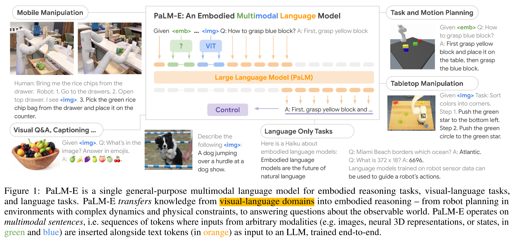

# 1. 背景介绍
在今年AI视觉顶级会议「CVPR-2023」Autonomous Driving WorkShop上，自动驾驶的头部企业Wayve和Tesla，分享了各自在Autonomous Driving领域的最新进展（详细汇报参见[34][35]）：AI Foundation Model，特别是**大语言模型LLM**，在自动驾驶领域的重要机会和各方面应用，如下：
1. 多模态(vision,language,action)的融合理解：基于已学习的驾驶领域通识(language)，理解当下场景(vision)，做出驾驶行为(action)的规划；
2. 利用LLM推理能力，解决自动驾驶领域的场景多样性、物体多样性、行为多样性等长尾问题；
3. 学习驾驶知识和当地法规，实现快速迁移到new cities, countries, cultures；
4. 可遵循Prompt，根据Feedback进行自学习；

会议中提出：端到端的自动驾驶，是否可以通过基于LLM Q&A来辅助实现？
Wayve CEO认为：**LLM具备“感知”-“推理”-“规划”的能力，可以感知当前场景，做出驾驶行为规划；**进一步，Wayve基于LLM实现了在驾驶过程中的**即时解释**，DEMO如下。我们可以看到：LLM实时感知图片状态(Perception)，并精准规划每一个驾驶操作的原因(Planning)。<br>
- Wayve自动驾驶可解释 <br>

<br>

基于LLM在自动驾驶中的应用，我们再来看几个视频：

1. 自动驾驶仿真：需要基于当前场景完成感知(①Perception)，预测未来多种可能性(②Prediction)，并根据不同可能做出对应的驾驶规划(③Planning)<br>
Tesla自动驾驶仿真效果，如下：<br>
 <br>
Wayve自动驾驶仿真效果，如下：<br>
 <br>

2. Google Embodied AI <br>
PaLM-E[40]命令机器人从抽屉中取薯片的动作，机械人需要理解用户指令，感知当下环境，做出对应动作规划。见下述视频。<br>
 <br>

3. LanguageMPC，将LLM和MPC相结合的新型类人智驾系统 <br>
10月4号，由清华、港中文和伯克利，联合发表LanguageMPC，将LLM作为自动驾驶的决策核心，生成驾驶指令，指挥下游控制模块MPC完成驾驶任务。下述视频中，我们看到：路口左转时，LLM能根据交通规则，让行对向直行车辆。 <br>
 <br>

上述一系列的工作，包括“有针对性地生成多样性的场景样本，用于模型训练，可有效提升模型的性能和鲁棒性”，“端到端的Embodied AI可用于实现end to end的自动驾驶指令的生成”，让我们看到了LLM在提升自动驾驶Percption/Prediction/Planning的潜力，**它具备World Knowledge(领域常识，如规避行人、遵守交通规则等)，遵循人类指令(Instruction Following，比如指定生成雪天的样本)，基于过去场景和当下状态(多模态输入，包括视频、图片、文本等)，预测未来(即：Predict Next Picture or Next Controls)。**

**做一个小结**：

当前的自动驾驶算法：
1. 缺乏基于World Knowledge的推理能力，在理解交通法规(如左转让直行)等高级信息上存在困难；
2. 受限于视频样本的数据量和采样效率，处理罕见事件是面临的一大挑战；
3. 黑盒特性，对未来轨迹的预测，缺乏良好的可解释性；

由于LLM具备：
1. Instruction Following：理解并遵循用户指令控制；
2. World Knowledge：基于互联网海量数据的跨任务的训练和学习，产生近似人类的领域通识和推理能力；->「prediction」&「Planning」
3. Multi-modal Inputs：Transformer天然的多模态处理和对齐能力，实现文本跟图像等多模态间的融合学习；->「Perception」
4. Predict Next Picture or Controls：可预测下一张图片或者控制命令；->「prediction」&「Planning」

我们将LLM引入到自动驾驶领域，作为统一的Foundation model，来辅助解决上述一系列问题。

## 1.1 深入研究
下面我们进一步研究LLM在上述四个能力上的效果和实现细节。其中，LLM遵循用户指令是显然的，接下来着重研究LLM在实现其他3个能力上的设计。

**1.World Knowledge** <br>
下面是LLM在自动驾驶领域中的QA，可以看到LLM已经学习了海量的驾驶知识，完全可以作为经验丰富的驾驶者。这是LLM原生已具备的学习和推理能力。<br>


**2.Multi-modal Inputs** <br>
我们知道，Transformer架构，具备天然的多模态潜力，经过ViT[41]实现了vision模态的处理，经过clip[42]实现了vison和text的对齐，经过point-llm[43]实现了3D点云模态的支持。那么，基于LLM之上增加Multi-modal的支持也是非常容易的，[16][17][18][19][21][22]均为多模态的LLM。下面是Multi-modal LLM针对驾驶场景的图片的QA的效果。<br>


**3.Predict Next Picture or Controls** <br>
LLM是predict next word，这里我们期望的是predict next picture (或 predict next control-instruction)。<br>
这里，我们可以调整LLM的输出，使得LLM输出到latent embedding space，即我们得到包含语义的latent embedding。该latent embedding可经由不同的Task-specific Decoder，还原为对应的picture或者control-instruction。

**至此，我们将「predicting the future」任务，重新定义为「predicting the next token」任务。** 类似的思路，可以参考最新研究[37][38]。<br>
**因此，该架构为「Multi-modal LLM」 + 「Task-specific Decoders」** <br>

接下来我们看几个业界头部玩家的Foundation Model架构。

## 1.2 业界尝试
**1. Wayve GAIA-1[39]技术架构(Tesla类似)** <br>
该架构是Wayve公司自动驾驶领域的World Model架构，用于做自动驾驶的预测和仿真。我们可以看到，同样地，采用Multi-modal LLM + Decoder(Vedio Generator)<br>


**2. Google PaLM-E[40]技术架构** <br>
Google Embodied AI工作，同样地，采用Multi-modal LLM + Decoder(Controls Generator)<br>


**3. LanguageMPC** <br>
采用LLM + Decoder方式，由LLM感知+生成驾驶指令，指挥下游控制模块MPC完成驾驶任务，模型架构如下<br>


## 1.3 总结
可见，多模态LLM在自动驾驶领域，甚至是更广阔的Embodied AI领域，有着不可替代的作用。因此，搭建一套灵活的**Multi-modal LLM + Task-specific Decoders框架**非常必要和关键，它可以很好地处理多模态信息，完成任务推理和执行。同时各类经验表明joint training可以使得模型效果更好。


## 2 架构设计
基于上述调研，我们设计Foundation Model的整体网络架构，包括：<br>
1. 支持多模态输入，实现各模态间的对齐；<br>
2. LLM作为Backbone，理解用户指令完成推理，生成Latent Prompt Embedding；<br>
3. 各Task-specific Decoders，基于生成的Prompt Embedding，完成各类任务；<br>

**整体模型架构**，如下图所示：<br>


上述架构中，标记雪花的Module代表该模块冻住参数，标记火焰的Module代表该模块参与训练，未标记的Module代表该模块可以根据情况来选择是否Fine Tuning。其中，各Module功能描述如下：<br>

**1. Visual Encoder**
    
    用于进行图像(或视频)的编码，转为LLM可以消费的token embedding，即LLM Adapter，该模块是实现多模态LLM的基础步骤。
    可以选用 Clip image-encoder[31] 或者 IMAGE BIND[32] 完成编码；其中，IMAGE BIND的好处是已经在大量多模态语料中进行训练，实现了各类模态的语义对齐。

**2. Input Projector**
    
    LLM-centric alignment，用于将上步骤生成的Visual Embedding，与LLM的输入空间进行语义上的对齐；
    该Module一般需要训练。如果该Module已经经过Multi Modal LLM（如LLaVA）训练过，也可以冻结。

**3. LLM**
    
    Large Language Model，是整个架构的核心，用于完成基于user instruction following的推理任务；
    扩展LLM的词表Tokenizer，用于识别\\<seg\>等图像处理Token；
    比如在我们的场景中，我们需要LLM输出Token <seg>，用于指示接下来进行分割任务。对应\<seg\>的LLM output embedding用于接下来的下游任务。

    
**4. Output Projector**
    
    Prompt-centric alignment，用于将上步骤中得到的LLM Output Embedding，跟下游的各个Task-specific Decoder的Prompt空间进行语义对齐；

**5. Decoders**
    
    Task-specific Decoder，比如：
    1.Contols Decoder，用于执行控制指令生成，可以选用RT-1[47], RT-2[48]；
    2.Det Decoder，用于执行目标检测任务，可以选用DINO Decoder[33]；
    3.Seg Decoder，用于执行图像分割任务，可以选用SAM Decoder[2]；
    4.Gen Decoder，用于执行图像生成任务，可以选用Stable Diffusion Decoder[14]；
    
    5.Others ...;

# 3 落地路径
基于上述架构设计，我们从Perception入手，基于长尾Case和OOD(Out of Distribution[1])的场景，落地一套**通用的LLM代码框架**，可以很好的支持未来扩展的**易用性**和**灵活性**。

据世卫组织《全球道路安全现状报告》，除了酒驾、疲劳驾驶等人为因素，偏离正常交通状况的意外行为或物体，往往是造成交通事故的主要原因之一，比如：“高速路上的动物”、“货车上掉下的物品”、“山上滚落的石块”等等。

自动驾驶(AD)技术，可以有效降低人为因素导致的安全事故，但同样，对上述所提到的不常见物体或者称为**OOD的物体**，可能会由于训练样本的稀缺，造成感知模型学习严重不足进而造成检测失败，接着影响接下来的prediction和planning，导致AD算法做出错误控制指令，影响驾乘体验，严重者甚至造成交通事故。

那么，**OOD样本的识别和构建**，已经成为当今自动驾驶技术能否安全落地的重要挑战之一。


## 3.1 目标拆解
训练样本中OOD物体严重不足，是造成perception算法识别该物体差的原因。因此，①挖掘感兴趣的OOD物体，并②增加相应的OOD样本用于算法学习，是核心解决方案。包括：<br>
    
**1. 挖掘感兴趣的OOD数据**<br>
* **步骤(1)**：描述驾驶图像(来自驾驶视频采帧)中有什么物体（或物体的子部分），以及物体之间或者物体子部分之间的关系；<br>
  * 涉及「image caption」任务；<br>
* **步骤(2)**：基于上述对图片的描述，挖掘感兴趣OOD物体的描述；<br>
  * 可以采用TF-IDF等data mining算法，挖掘不常见物体关键字；<br>

**2. 增加相对应的OOD样本**<br>
* **步骤(3)**：基于感兴趣OOD物体的描述，对图像进行分割，获取该OOD物体的分割图（可能是物体或物体子部分）；<br>
  * 涉及「semantic segmentation」任务，进一步细化，包括：「refering segmentation」，「part segmentation」，以及「panoptic segmentation」等任务，同时需要根据描述实现推理分割，称为「reasoning segmentation」。同时，此类任务要求支持open vocabulary segmentation； <br>
* **步骤(4)**：上述分割图作为few shots，结合text prompt对场景的描述，生成带有OOD物体的场景图片或者视频；<br>
  * 涉及基于image prompt的「image generation」任务和「video generation」任务，进一步细化，包括：定向生成OOD物体到图像固定位置中的「image inpainting」任务 等；<br>
<br>

**总结一下，即包含下述10个目标子任务：**
- image caption
- semantic segmentation
- referring segmentation
- part segmentation
- panoptic segmentation
- reasoning segmentation
- open vocabulary
- image generation
- video generation
- image inpainting

## 3.2 任务流程
 <br>


# 4. 方案设计

## 4.1 方案调研
根据3.2节的目标拆解，调研相关任务的业界实现方案，总结如下表：
<table>
<tbody>
    <tr>
        <th valign="bottom">Method Name</th>
        <th valign="bottom">Method Type</th>
        <th valign="bottom">image caption</th>
        <th valign="bottom">semantic segmentation</th>
        <th valign="bottom">referring segmentation</th>
        <th valign="bottom">part segmentation</th>
        <th valign="bottom">panoptic segmentation</th>
        <th valign="bottom">reasoning segmentation</th>
        <th valign="bottom">open vocabulary</th>
        <th valign="bottom">image generation</th>
        <th valign="bottom">video generation</th>
        <th valign="bottom">image inpainting</th>
    </tr>
    <tr>
        <td align="left">SAM[2]</td>
        <td align="center">segmentation</td>
        <td align="center">❌</td>
        <td align="center">❌</td>
        <td align="center">❌</td>
        <td align="center">✔️</td>
        <td align="center">✔️</td>
        <td align="center">❌</td>
        <td align="center">❌</td>
        <td align="center">❌</td>
        <td align="center">❌</td>
        <td align="center">❌</td>
    </tr>
    <tr>
        <td align="left">Semantic SAM[3]</td>
        <td align="center">segmentation</td>
        <td align="center">❌</td>
        <td align="center">✔️</td>
        <td align="center">✔️</td>
        <td align="center">✔️</td>
        <td align="center">✔️</td>
        <td align="center">❌</td>
        <td align="center">✔️</td>
        <td align="center">❌</td>
        <td align="center">❌</td>
        <td align="center">❌</td>
    </tr>
    <tr>
        <td align="left">Grounded SAM[4]</td>
        <td align="center">segmentation</td>
        <td align="center">❌</td>
        <td align="center">✔️</td>
        <td align="center">✔️</td>
        <td align="center">✔️</td>
        <td align="center">✔️</td>
        <td align="center">❌</td>
        <td align="center">✔️</td>
        <td align="center">❌</td>
        <td align="center">❌</td>
        <td align="center">❌</td>
    </tr>
    <tr>
        <td align="left">ODISE[5]</td>
        <td align="center">segmentation</td>
        <td align="center">❌</td>
        <td align="center">✔️</td>
        <td align="center">✔️</td>
        <td align="center">✔️</td>
        <td align="center">✔️</td>
        <td align="center">❌</td>
        <td align="center">✔️</td>
        <td align="center">❌</td>
        <td align="center">❌</td>
        <td align="center">❌</td>
    </tr>
    <tr>
        <td align="left">OpenSeeD[6]</td>
        <td align="center">segmentation</td>
        <td align="center">❌</td>
        <td align="center">✔️</td>
        <td align="center">✔️</td>
        <td align="center">❌</td>
        <td align="center">✔️</td>
        <td align="center">❌</td>
        <td align="center">✔️</td>
        <td align="center">❌</td>
        <td align="center">❌</td>
        <td align="center">❌</td>
    </tr>
    <tr>
        <td align="left">SEEM[7]</td>
        <td align="center">segmentation</td>
        <td align="center">❌</td>
        <td align="center">✔️</td>
        <td align="center">✔️</td>
        <td align="center">❌</td>
        <td align="center">✔️</td>
        <td align="center">❌</td>
        <td align="center">✔️</td>
        <td align="center">❌</td>
        <td align="center">❌</td>
        <td align="center">❌</td>
    </tr>
    <tr>
        <td align="left">SegGPT[8]</td>
        <td align="center">segmentation</td>
        <td align="center">❌</td>
        <td align="center">❌</td>
        <td align="center">✔️</td>
        <td align="center">❌</td>
        <td align="center">❌</td>
        <td align="center">❌</td>
        <td align="center">✔️</td>
        <td align="center">❌</td>
        <td align="center">❌</td>
        <td align="center">❌</td>
    </tr>
    <tr>
        <td align="left">X-Decoder[9]</td>
        <td align="center">comprehensive</td>
        <td align="center">✔️</td>
        <td align="center">✔️</td>
        <td align="center">✔️</td>
        <td align="center">❌</td>
        <td align="center">✔️</td>
        <td align="center">❌</td>
        <td align="center">✔️</td>
        <td align="center">✔️</td>
        <td align="center">❌</td>
        <td align="center">✔️</td>
    </tr>
    <tr>
        <td align="left">VLPart[10]</td>
        <td align="center">segmentation</td>
        <td align="center">❌</td>
        <td align="center">❌</td>
        <td align="center">❌</td>
        <td align="center">✔️</td>
        <td align="center">❌</td>
        <td align="center">❌</td>
        <td align="center">❌</td>
        <td align="center">❌</td>
        <td align="center">❌</td>
        <td align="center">❌</td>
    </tr>
    <tr>
        <td align="left">Caption Any Thing[11]</td>
        <td align="center">caption</td>
        <td align="center">✔️</td>
        <td align="center">❌</td>
        <td align="center">❌</td>
        <td align="center">❌</td>
        <td align="center">❌</td>
        <td align="center">❌</td>
        <td align="center">❌</td>
        <td align="center">❌</td>
        <td align="center">❌</td>
        <td align="center">❌</td>
    </tr>
    <tr>
        <td align="left">RAM[12]</td>
        <td align="center">caption</td>
        <td align="center">✔️</td>
        <td align="center">❌</td>
        <td align="center">❌</td>
        <td align="center">❌</td>
        <td align="center">❌</td>
        <td align="center">❌</td>
        <td align="center">❌</td>
        <td align="center">❌</td>
        <td align="center">❌</td>
        <td align="center">❌</td>
    </tr>
    <tr>
        <td align="left">BLIP2[13]</td>
        <td align="center">caption</td>
        <td align="center">✔️</td>
        <td align="center">❌</td>
        <td align="center">❌</td>
        <td align="center">❌</td>
        <td align="center">❌</td>
        <td align="center">❌</td>
        <td align="center">❌</td>
        <td align="center">❌</td>
        <td align="center">❌</td>
        <td align="center">❌</td>
    </tr>
    <tr>
        <td align="left">Stable Diffusion[14]</td>
        <td align="center">generation</td>
        <td align="center">❌</td>
        <td align="center">❌</td>
        <td align="center">❌</td>
        <td align="center">❌</td>
        <td align="center">❌</td>
        <td align="center">❌</td>
        <td align="center">❌</td>
        <td align="center">✔️</td>
        <td align="center">❌</td>
        <td align="center">✔️</td>
    </tr>
    <tr>
        <td align="left">Video LDM[15]</td>
        <td align="center">generation</td>
        <td align="center">❌</td>
        <td align="center">❌</td>
        <td align="center">❌</td>
        <td align="center">❌</td>
        <td align="center">❌</td>
        <td align="center">❌</td>
        <td align="center">❌</td>
        <td align="center">❌</td>
        <td align="center">✔️</td>
        <td align="center">❌</td>
    </tr>
    <tr>
        <td align="left">EMU[16]</td>
        <td align="center">comprehensive</td>
        <td align="center">✔️</td>
        <td align="center">❌</td>
        <td align="center">❌</td>
        <td align="center">❌</td>
        <td align="center">❌</td>
        <td align="center">❌</td>
        <td align="center">❌</td>
        <td align="center">✔️</td>
        <td align="center">❌</td>
        <td align="center">❌</td>
    </tr>
    <tr>
        <td align="left">MiniGPT4[17]</td>
        <td align="center">comprehensive</td>
        <td align="center">✔️</td>
        <td align="center">❌</td>
        <td align="center">❌</td>
        <td align="center">❌</td>
        <td align="center">❌</td>
        <td align="center">❌</td>
        <td align="center">❌</td>
        <td align="center">❌</td>
        <td align="center">❌</td>
        <td align="center">❌</td>
    </tr>
    <tr>
        <td align="left">LLaVA[18]</td>
        <td align="center">comprehensive</td>
        <td align="center">✔️</td>
        <td align="center">❌</td>
        <td align="center">❌</td>
        <td align="center">❌</td>
        <td align="center">❌</td>
        <td align="center">❌</td>
        <td align="center">❌</td>
        <td align="center">❌</td>
        <td align="center">❌</td>
        <td align="center">❌</td>
    </tr>
    <tr>
        <td align="left">LISA[19]</td>
        <td align="center">comprehensive</td>
        <td align="center">❌</td>
        <td align="center">❌</td>
        <td align="center">❌</td>
        <td align="center">❌</td>
        <td align="center">❌</td>
        <td align="center">✔️</td>
        <td align="center">❌</td>
        <td align="center">❌</td>
        <td align="center">❌</td>
        <td align="center">❌</td>
    </tr>
    <tr>
        <td align="left">XGPT[20]</td>
        <td align="center">comprehensive</td>
        <td align="center">✔️</td>
        <td align="center">✔️</td>
        <td align="center">✔️</td>
        <td align="center">❌</td>
        <td align="center">✔️</td>
        <td align="center">❌</td>
        <td align="center">✔️</td>
        <td align="center">✔️</td>
        <td align="center">❌</td>
        <td align="center">✔️</td>
    </tr>
    <tr>
        <td align="left">PandaGPT[21]</td>
        <td align="center">comprehensive</td>
        <td align="center">✔️</td>
        <td align="center">❌</td>
        <td align="center">❌</td>
        <td align="center">❌</td>
        <td align="center">❌</td>
        <td align="center">❌</td>
        <td align="center">❌</td>
        <td align="center">❌</td>
        <td align="center">❌</td>
        <td align="center">❌</td>
    </tr>
    <tr>
        <td align="left">NExT-GPT[22]</td>
        <td align="center">comprehensive</td>
        <td align="center">✔️</td>
        <td align="center">❌</td>
        <td align="center">❌</td>
        <td align="center">❌</td>
        <td align="center">❌</td>
        <td align="center">❌</td>
        <td align="center">❌</td>
        <td align="center">✔️</td>
        <td align="center">✔️</td>
        <td align="center">❌</td>
    </tr>
</tbody>
</table>

接下来，我们从三个维度（功能上、效果上、以及未来扩展性上）来衡量上述各类方案，在我们目标任务上的表现。
首先，以上方案可以大致分为：1. 面向特定任务的架构(Task-specific)；2. 面向通用性任务的架构(Comprehensive Task)；


<br>

**1. Segmentation Task-specific Architecture**

    面向Segmentation任务的特定架构，仅支持Segmentation任务。选取支持Open Vocabulary的Segmentation方法，经过实测：
        (1)从功能上：上述方法均不支持reasoning segmentation任务；
        (2)从效果上：上述方法在referring segmentation任务表现不符合预期，核心原因是，较简单的Text Encoder对user instruction的理解，无法达到LLM的能力水位；
        (3)从扩展上：上述方法扩展性足够，且均支持Open Vocabulary；
    
    因此，我们可以选取业界最新工作Semantic SAM[3]作为我们Segmentation Task的基础；

**2. Caption Task-specific Architecture**

    面向Caption任务的特定架构，仅支持Caption任务。该架构又分为两类：传统非LLM模型“not LLM” 和 多模态的语言模型“MLLM”

    1. not LLM
        代表为RAM。
        (1)从功能上：可以支持基础的image caption，但无法生成详细描述；
        (2)从效果上：无法实现对“物体与物体之间的关系”或“物体的子部分之间的关系”的详细描述；
        (3)从扩展上：扩展性较弱，不容易扩展支持上述能力；

    2. MLLM
        代表为Blip2和Caption Anything。Caption Anything底层依赖Blip，在Blip基础上扩展了对图像中指定物体的描述。
        (1)从功能上：可以支持基础的image caption，并生成详细描述；
        (2)从效果上：可实现对“物体与物体之间的关系”或“物体的子部分之间的关系”的详细描述；
        (3)从扩展上：扩展性较强，借助LLM能力可以较好地实现user instruction following；
    
    因此，选取MLLM架构，作为我们Caption Task的基础；

**3. Generation Task-specific Architecture**

    面向Generation任务的特定架构，核心代表为Stable Diffusion，目前支持文生图、图生图等各类Image Generation任务，视频生成可以参考Video LDM(底层架构基于Stable Diffusion)。
        (1)从功能上：可以支持image generation、image inpainting、video generation等各类任务；
        (2)从效果上：SD算法的图像生成能力无论是在清晰度还是多样性，均达到了SOTA水平；
        (3)从扩展上：扩展性较强，支持各类Prompt和基于LoRa或ControlNet的Tuning；
    
    因此，我们以扩散模型的代表SD算法，作为我们Generation Task的基础；

**4. Comprehensive Task Architecture**
    
    上述1-3这三类架构，是面向特定任务场景的架构。Comprehensive Task Architecture是多任务的架构，可以同时支持多类任务。
    1. not LLM
    不依赖LLM，核心代表为XDecoder。Xdecoder的核心思想是作为“统一的Decoder”支持各类下游图像任务，如Caption任务、目标检测任务、图像分割任务等等，因此其核心是生成，对于user instruction following就比较弱；
        (1)从功能上：可以支持caption、segmentation、generation等各类任务；
        (2)从效果上：无法很好的理解user instruction，并follow instruction；
        (3)从扩展上：就下游Decoder任务来讲，扩展性较强；
    
    2. LLM
    LLM架构，通过不同方式来扩展LLM，使得LLM可以支持多模态的输入和输出。根据扩展方式不同，又分为下述两大类：2.1 LLM通过LangChain工具链方式，调用外部工具实现多模态交互；2.2 通过更改LLM架构，使得LLM支持多模态的输入，进而实现多模态交互能力。详细对比如下：
    2.1. LLM + Chain of Thought
    代表为XGPT，上面分析到XDecoder虽然可以作为各个图像任务的工具Tool，但在instruction following上存在局限性，因此XGPT引入LLM：基于LangChain思想，借助LLM来follow user instruction，然后转为对XDecoder的Tool调用。
        (1)从功能上：同样可以支持XDecoder已支持的各类图像任务；
        (2)从效果上：①LLM和XDecoder是完全独立的关系，效果受限于XDecoder；且该完全独立的关系，使得LLM的输出与XDecoder输入之间，不能对齐，仅能通过文本交互，效果上打折扣；
        (3)从扩展上：LLM和XDecoder是完全独立的关系，使得整个架构无法支持End2End的Tuning，对于效果不理想的Case，不容易提升；

    2.2. MLLM
    代表像MiniGPT、PandaGPT、LLaVA，以及近期的一些工作LISA、EMU、NExT-GPT等，均实现了多模态的LLM。
        (1)从功能上：MiniGPT、PandaGPT、LLaVA等，进实现了支持多模态的输入，不能进行多模态的输出任务；LISA、EMU等通过扩展实现多模态输出，但是都未全面支持我们需要的目标子任务，比如EMU和NExT-GPT均未支持Segmentation、LISA未支持Generation等；
        (2)从效果上：MLLM在各自已经支持的任务上，有比较满意的表现，且基于LLM具备很好的instruction following；
        (3)从扩展上：架构扩展性良好，但多数MLLM库，由于前期仅仅面向自己关注的任务，在代码扩展性的设计比较差，缺乏基于后续任务可插拔的良好抽象；


**总结**<br>
1. 对于Segmentation Task-specific Architecture，当前分割模型的open vocabulary的能力基本可以满足诉求，需要借助LLM加强referring segmentation语义理解能力，同时补充reasoning segmentation。该Architecture作为我们架构中的Seg Decoder Module；
2. 对于Caption Task-specific Architecture，non LLM模型对Caption的描述效果不足，无法描述物体与物体的关系，以及物体子部分的关系，需要借助LLM；而Caption任务下的LLM模型无法分割图片或生成图片，需要扩展；
3. 对于Generation Task-specific Architecture，可以满足诉求，该Architecture作为我们架构中的Gen Decoder Module；
4. 对于Comprehensive Task Architecture，MLLM是更具扩展性的架构；

**综上所述，核心思路是，以MLLM为中心来接收User Instruction，同时扩展MLLM可以根据Instruction Intent来生成供不同下游任务使用的Prompt Embedding，进而精准控制各类Decoder执行任务；**


# 5. 核心实现
## 5.1 代码架构
多数MLLM开源代码库，由于前期仅仅面向自己关注任务进行编码，在代码扩展性上的设计比较差，缺乏面向后续任务可插拔的良好抽象。<br>
这里，从未来各多模态任务扩展的 **“①灵活性”** 和 **“②易用性”** 角度出发，进行代码架构的设计，核心包含下述特性：

**1. 统一的 train & inference 流程模板设计**<br>
可作为企业统一的多模态任务架构，支持以LLM为中心的各类模型任务；

**2. 模型中各Module独立可插拔**<br>
灵活定义或更换encoder、projector、tokenizer、backbone、decoder等Module，仅需要简单更改yaml配置<br>

**3. 下游Decoder Module可灵活扩展**<br>
多Decoder设计，支持通过yaml配置文件，添加新的Task Decoder；

**4. 高度可配置化，提升扩展的易用性**<br>
使用yaml统一管理模型中的各个Module和超参数；样例如下：<br>
(1). Module选择配置化，
    
        one model:
            # 类型
            type: "one_model"
            dataset: ["cc3m"]
            encoder: clip_encoder
            in_projector: image_proj_13B
            tokenizer: llama2_13B
            llm: llava_13b
            out_projector: mlp_out_13B
            decoder: sam_decoder_h
            # 对话模版，取决于llm的类型
            conv_type: "plain"
            # 训练模式，0: pretrain (train encoder and projector), 1: finetune (train decoder and projector), 2: full train (train encoder and decoder projector)
            train_mode: 1

(2). 模型超参配置化
    
        trainer:
            task: image_text_pretrain
            # optimizer
            lr_sched: "linear_warmup_cosine_lr"
            init_lr: 1e-4
            min_lr: 8e-5
            warmup_lr: 1e-6
            weight_decay: 0.05
            max_epoch: 4
            batch_size_train: 64
            batch_size_eval: 64
            num_workers: 4
            warmup_steps: 5000
            iters_per_epoch: 5000
            output_dir: "output/minigpt4_stage1_pretrain"
            amp: True
            resume_ckpt_path: null
            evaluate: False
            train_splits: ["train"]
            bits: 8
**5. 分布式DeepSpeed训练框架，支持多机多卡**


## 5.2 模型训练
为了防止LLM灾难性遗忘，同时提升训练效率，选择下述策略：<br>
**1. End2End Tuning**

    1.Visual Encoder，Freeze
        Load weights from CLIP Image Encoder
    2.Input Projector，Freeze
        Load weights from LLaVA的input projector
    3.LLM，Freeze(Tuning with LoRA[30])
        Load weights from LLAMA2-13B，tuning with LoRA，other prompt tuning method referring[27, 28, 29]，apply on transformer decoder block(contains sq-proj, k-proj, v-proj, o-proj)
    4.Output Projector(for Segementation)，Fine Tuning
        Load weights from LISA Output Projector
    5.Decoder(for Segementation)，Freeze
        Load weights from Semantic-SAM。
        Semantic-SAM[3]是最新工作，复现了SAM[2]能力，并在Semantic Segmentation、Part Segmentation、Panoptic Segmentation等各类分割任务上达到了SOTA：
        (1)在Panoptic Segmentation，较OpenSeeD[6]提升1.3%，较X-Decoder[9]提升6.1%；
        (2)在Part Segmentation，较VLPart[10]提升4%；
        (3)在高质量mask生成上，较SAM[2]提升25.4%，较SEEM[7]提升2.4%；
        综上，我们选择基于Semantic-SAM来支持各类segmentation任务

**2. jointly train**<br>
训练过程中，同时加入原始LLaVA数据集：LLaVA-Instruct-150k，参考EMU[16]移除detailed description subset和“on top of the back of” pattern，即LLaVA-Instruct-130k；


### 5.2.1 数据集构造
**1. caption任务** <br>

**2. segmentation任务** <br>
接收Reasoning Segmentation指令；<br>
接收Panoptic Segmentation指令；<br>
接收Part Segmentation指令；<br>

**3. generation任务** <br>
基于Stable Diffusion，由于时间关系，我们放在未来工作中

### 5.2.2 训练细节
目前训练使用lora 微调LLM，对于sam的projector 需要全量训练，预估的参数量如下
```
trainable params: 4,194,304 || all params: 6,742,609,920 || trainable%: 0.06220594176090199
```
训练细节
使用deepspeed 进行单机多卡训练， 代码实现基于pytorch 和 transformer, 整个框架通过yaml 配置驱动，可以自由组装各个组件

### 5.2.3 资源预估 
            

# 6. 操作手册
安装使用详见 [安装](./docs/install.md)
## 6.1 训练
参考 train.sh 脚本，训练的时候需要指定模型的版本，13B或者7B的， 数据集的目录， 和结果文件的目录
```bash
sh scripts/train.sh
```
## 6.2 预测
参考 infer.sh, 可以设置int8 或者 int4量化
```bash
sh scripts/infer.sh 
```
## 6.3 切换Module
### 6.3.1 切换backbone
目前使用的是llava 13B做为backbone， 可以切换成7B的， 需要修改对应的 yaml 文件
修改前
```
llm:
  llava_13b:
    type: llava
    model_name_or_path: ${base_dir}/LLaVA/checkpoints/llava-13b-llama-2-13b-chat
    lora_enable: true
    freeze: false
    load_in_8bit: false
    lora_r: 8
one_model:
  type: "one_model"
  llm: llava_13b

```
修改后
```
llm:
  llava_7b:
    type: llava
    model_name_or_path: ${base_dir}/LLaVA/checkpoints/llava-7b-llama-2-7b-chat
    lora_enable: true
    freeze: false
    load_in_8bit: false
    lora_r: 8
one_model:
  type: "one_model"
  llm: llava_7b

```
### 6.3.2 切换encoder
目前默认使用的是clip vit-large， 可以切换成blip 或者 clip-base 的， 需要修改对应的yaml文件
修改前
```
encoder:
  clip_encoder:
    type: clip
    model_name_or_path: ${base_dir}/LLaVA/checkpoints/clip-vit-large-patch14
    freeze: true
    select_feature_layer: -2
one_model:
  type: "one_model"
  encoder: clip_encoder

```
修改后
```
encoder:
  clip_base_encoder:
    type: clip
    model_name_or_path: ${base_dir}/LLaVA/checkpoints/clip-vit-base-patch14
    freeze: true
    select_feature_layer: -2
one_model:
  type: "one_model"
  encoder: clip_base_encoder

```

### 6.3.3 切换projecter
目前实现了 mlp 的 projector 和 liner的projector， 切换的话需要修改对应的yaml文件
修改前
```
projector:
  image_proj_7B:
    type: "linear"
    in_features: 1024
    out_features: 4096
    freeze: true
    ckpt_path: ${base_dir}/LLaVA/tools/7B_mm_projector.pt
one_model:
  type: "one_model"
  in_projector: image_proj_7B

```
修改后
```
projector:
  image_proj_13B:
    type: "linear"
    in_features: 1024
    out_features: 5120
    freeze: true
    ckpt_path: ${base_dir}/LLaVA/tools/13B_mm_projector.pt
one_model:
  type: "one_model"
  in_projector: image_proj_13B
```
## 6.4 增加Decoder
目前默认使用的是sam decoder 用于分割任务，如果要增加decoder 需要自己实现 decoder的 forward方法
例子如下
```python
@DECODER_REGISTRY.register(alias="custom_decoder")
class CustomDecoder(nn.Module):
    def __init__(self, model_name_or_path, model_type, train_mask_decoder) -> None:
        super().__init__()
        # TODO init model logic

    def forward(
        self,
        image_paths,
        hidden_states,
        gt_masks,
        inference,
        seg_token_mask,
        offset: torch.LongTensor,
        **kwargs,
    ):
        
        #TODO 实现训练方法， 根据inference 是否为true 处理训练和预测分支逻辑，训练的时候需要返回loss， 预测不需要

    @staticmethod
    def from_config(config):
        # 初始化方法，参数解析
        model_name_or_path = config.get("model_name_or_path")
        train_mask_decoder = config.get("train_mask_decoder", True)
        model_type = config.get("model_type", "sam_l")
        return CustomDecoder(
            model_name_or_path,
            model_type,
            train_mask_decoder,
        )

```

# 7. 效果展示

# 8. 未来工作
1. Simulation工作，该部分工作放在未来实现；
2. End2End AD工作，该部分工作放在未来实现；


# 9. 参考文献
[1] OOD Survey - Generalized Out-of-Distribution Detection- A Survey <br>
[2] SAM - Segment Anything <br>
[3] Semantic SAM - Segment and Recognize Anything at Any Granularity <br>
[4] Grounded SAM - https://github.com/IDEA-Research/Grounded-Segment-Anything <br>
[5] ODISE - Open-Vocabulary Panoptic Segmentation with Text-to-Image Diffusion Models <br>
[6] OpenSeeD - A Simple Framework for Open-Vocabulary Segmentation and Detection <br>
[7] SEEM - Segment Everything Everywhere All at Once <br>
[8] SegGPT- Segmenting Everything In Context <br>
[9] X-Decoder - Generalized Decoding for Pixel, Image, and Language <br>
[10] VLPart - Going Denser with Open-Vocabulary Part Segmentation <br>
[11] Caption Anything- Interactive Image Description with Diverse Multimodal Controls <br>
[12] RAM - Recognize Anything- A Strong Image Tagging Model <br>
[13] BLIP-2- Bootstrapping Language-Image Pre-training with Frozen Image Encoders and Large Language Models <br>
[14] Stable Diffusion - High-Resolution Image Synthesis with Latent Diffusion Models <br>
[15] Video LDM - Align your Latents- High-Resolution Video Synthesis with Latent Diffusion Models <br>
[16] EMU - Generative Pretraining in Multimodality <br>
[17] MiniGPT-4- Enhancing Vision-Language Understanding with Advanced Large Language Models <br>
[18] LLaVA - Visual Instruction Tuning <br>
[19] LISA - REASONING SEGMENTATION VIA LARGE LANGUAGE MODEL <br>
[20] XGPT - https://github.com/microsoft/X-Decoder/tree/xgpt <br>
[21] PandaGPT - One Model To Instruction-Follow Them All <br>
[22] NExT-GPT - Any-to-Any Multimodal LLM <br>
[23] LLAMA2 - Open Foundation and Fine-Tuned Chat Models <br>
[24] Alpaca - A Strong, Replicable Instruction-Following Model <br>
[25] Vicuna - An Open-Source Chatbot Impressing GPT-4 with 90%* ChatGPT Quality <br>
[26] CoT - Chain-of-Thought Prompting Elicits Reasoning in Large Language Models <br>
[27] Adapter tuning - Parameter-Efficient Transfer Learning for NLP <br>
[28] Prefix-Tuning - Optimizing Continuous Prompts for Generation <br>
[29] Prompt Tuning - The Power of Scale for Parameter-Efficient Prompt Tuning <br>
[30] LoRA - Low-Rank Adaptation of Large Language Models <br>
[31] CLIP - Learning Transferable Visual Models From Natural Language Supervision <br>
[32] IMAGEBIND - One Embedding Space To Bind Them All <br>
[33] Grounding DINO - Marrying DINO with Grounded Pre-Training for Open-Set Object Detection<br>
[34] Wayve @ cvpr 2023 E2EAD(end2end Autonomous Driving) workshop : https://www.youtube.com/watch?v=Rn9mvSDdSqo<br>
[35] Tesla @ cvpr 2023 WAD(workshop ON Autonomous Driving) : https://www.youtube.com/watch?v=6x-Xb_uT7ts<br>
[36] Data Synthesis with Stable Diffusion for Dataset Imbalance - Computer Vision<br>
[37] Offline reinforcement learning as one big sequence modeling problem<br>
[38] Decision Transformer - Reinforcement Learning via Sequence Modeling<br>
[39] Wayve GAIA-1 - A Generative World Model for Autonomous Driving<br>
[40] PaLM-E - An Embodied Multimodal Language Model<br>
[41] ViT - An image is worth  16x16 words- Transformers for image recognition at scale<br>
[42] CLIP - Learning Transferable Visual Models From Natural Language Supervision<br>
[43] Point-Bind & Point-LLM- Aligning Point Cloud with Multi-modality for 3D Understanding, Generation, and Instruction Following<br>
[44] Imagen video: High definition video generation with diffusion models<br>
[45] Flexible diffusion modeling of long videos<br>
[46] Structure and content-guided video synthesis with diffusion models<br>
[47] RT-1: Robotics transformer for real-world control at scale <br>
[48] RT-2: Vision-Language-Action Models Transfer Web Knowledge to Robotic Control <br>
[49] LanguageMPC- LARGE LANGUAGE MODELS AS DECISION MAKERS FOR AUTONOMOUS DRIVING
